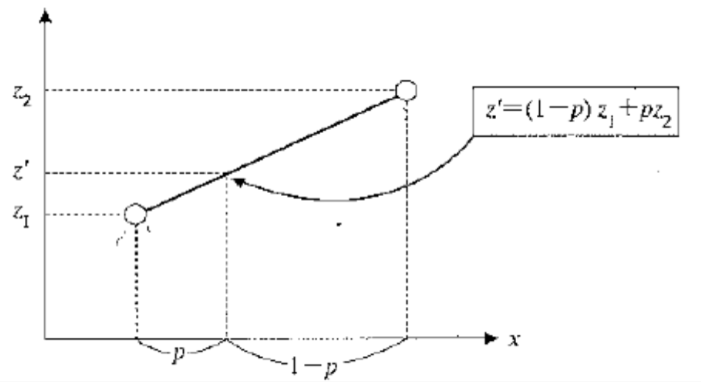

# 画像処理工学

[濃度反転](p1_Inverse_Mono_Click.scala)

[諧調度変換](p1_Level_Click.scala)

## 線形補間法

エッジ部分のギザギザを軽減するために用いられる

[線形補間法](p1_Size_Click.scala)

$` z' = (1-q){(1-q)*z[i,j] + p*z[i+1,j]} +q{[1-p]*z[i,j+1] + p*z[i+1,j+1]} `$

~~~scala
val a = 10
val b = a*a
~~~
